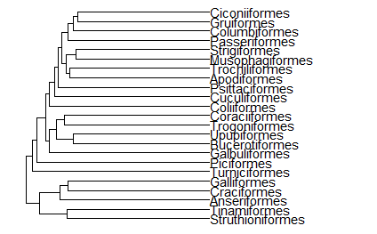

- [การติดตั้ง](#การติดตั้ง)
- [การพลอตกราฟ](#การพลอตกราฟ)
- [การ customization จากส่วนประกอบต่าง ๆ](#การ-customization-จากส่วนประกอบต่าง-ๆ)

หากใครค้นเคยกับการใช้แพจเกจ`ggplot2`ในการพลอตกราฟตามปกติแล้วต้องการพลอตกราฟ phylogeny แล้ว`ggtree`ก็เป็น extention ของแพจเกจนี้ซึ่งจะทำให้ผู้ใช้ที่คุ้นเคยอยู่แล้วใช้งานได้ไม่ยาก แถมยังใช้ร่วมกับคำสั่งเดิมของ`ggplot2`ได้อีก

โดยหลักการ function `ggtree()` จำเป็นต้องใช้ object ประเภท "phylo" เท่านั้น โดยประเภทของ object นี้สามารถอ่านได้จากบทความนี้

อย่างไรก็ตาม แพคเกจนี้ใช้เพื่อ visualize อย่างเดียว ไม่ใช่เพื่อ"สร้าง" tree เช่นเดียวกับ Figtree[^1] ดังนั้น ข้อมูลที่อ่านจึงมาจากไฟล์ที่เป็นนนามสกุลของ tree เช่น nexus,phylip เป็นต้น

> การ import ไฟล์เหล่านี้เข้ามาจำเป็นต้องใช้คำสั่งในแพคเกจอื่นเช่น ape::read.phylo()

## การติดตั้ง

เนื่องจากตัวแพคเกจไม่ได้อยู่บนฐานข้อมูลของ CRAN แต่อยู่บน Bioconductor ดังนั้นดราจะ install ด้วยคำสั่ง`install()`ของแพคเกจ`BiocManager`

> หากใครไม่มีแพคเกจนี้ในเครื่องอย่าลืมติดตั้งก่อน

```r
library(BiocManager)
BiocManager::install("ggtree")
library(ggtree)
data("bird.orders")
```

## การพลอตกราฟ

```r
p<-ggtree(bird.orders)
p+geom_tiplab()+expand_limits(x=50)
```



## การ customization จากส่วนประกอบต่าง ๆ

[^1]: http://tree.bio.ed.ac.uk/software/figtree/

[Back to top](#)
