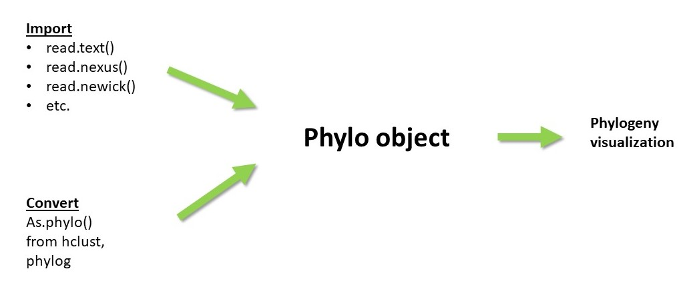

ในการจะทำอะไร็ตามจาก phylogeny ใน r หลัก ๆ จะทำงานผ่าน obj phylo นี้ เช่นการ visuya;ization tree การยุบ-รวม tree ต่าง ๆ

>object ประเภทนี้ มาจาก แพจเกจ `ape`


ประกอบไปด้วยอย่างน้อย 4 ส่วน ได้แก่

- edge
- tip.labels
- edge.length
- Nnode  

เราจะให้ r แสดงได้จาก หากใครมี rstudio ก็ดูได้จากแท๊บ environment ได้เลย หรือจากฟังก์ชั้น  `str()`

```
library(ape)
set.seed(99)
tree <- rtree(5) #ฟังชั่นสุ่มสร้าง tree ขึ้นมาโดยที่มี tip = 5
str(tree)
```

จะเเสดงผลแบบนี้ จะเห็นว่าหากเรา  แสดงที่ละส่วนดังนี้

```
List of 4
 $ edge       : int [1:8, 1:2] 6 7 7 8 9 9 8 6 7 1 ...
 $ tip.label  : chr [1:5] "t5" "t3" "t2" "t4" ...
 $ edge.length: num [1:8] 0.549 0.505 0.194 0.637 0.688 ...
 $ Nnode      : int 4

- attr(*, "class")= chr "phylo"
- attr(*, "order")= chr "cladewise"
```

โดย r จจะใช้ 4 ส่วนนนี้ในการพลอตกราฟ ซึ่งพลอตอย่างไรมาดูกัน

ส่วนแรก edge
ประกอบไปด้วยตาราง 2 คอลัม 8 แถว ซึ่งถ้าเทียบกับกราฟ สจำนวนแถวคือ จำนวนเส้นที่โยงในกราฟ
ตัวเลขในคอลัมแรกคือจุดเริ่มของเส้น และตัวเลยในคอลัมสองคือ จุดสิ้นสุดของเส้นโยง

```
tree$edge
#       [,1] [,2]
#[1,]    6    7
#[2,]    7    1
#[3,]    7    8
#[4,]    8    9
#[5,]    9    2
#[6,]    9    3
#[7,]    8    4
#[8,]    6    5
```

ส่วนที่ 2 คือ tip label เป็นส่วนที่
