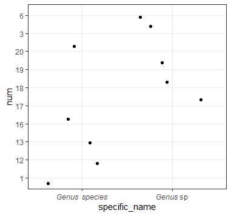

ในบางสถานการณ์ที่เราจำเป็นต้องระบุตัวเอียง และไม่เอียงปนกันไปบนกราฟ

> เช่น การพลอต species ที่ไม่ได้ถูกระบุ ติดเป็น sp. spp. sp1. sp2. เป็นต้น

เราจแก้ไขได้อย่างไร เราจะใช้ฟังก์ชั่นหนึ่งใน `ggtext package` ที่สามรถแสดงผลของ markdown ได้

> Markdown is a text-to-HTML conversion tool for web writers. Markdown allows you to write using an easy-to-read, easy-to-write plain text format, then convert it to structurally valid XHTML (or HTML). [^1]

ดังนั้นเราสามรถแทรกรูปแบบ tag บางอย่างจาก html หรือ ตัว `markdown` เอง เช่น ตัวเอียง เขียนด้วยการใส่ `*` ครอบเนื้อหาที่ต้องการได้

## เริ่มเลย เตรียมข้อมูลพลอตกราฟ

ถ้าใครมีอยู่แล้วก็ข้ามไป

```r
genus = rep("Genus",10)
sp = c(rep("species", 5),rep("sp",5))
num = sample(1:20,10)
dat = data.frame(cbind(genus,sp,num) )
head(dat)
```

ใส่รูป
เราก็จะได้ dataframe ที่มีช่อ genus และ specific appitet อยู่คนละ column
หากข้อมูลใครดันอยู่ใน column เดียวกันก็ใช้ฟังก์ชั่น`dplyr::separate()`ได้เลย

## ครอบด้วย "\*"

เราจะใช้ฟังก์ชั่น`glue::glue()`ซึ่งจะช่วงในเราแทนที่ของทั่ง column ได้เลย

> บางคนอาจคุ้น ๆ ว่าใช้`bqoute()`ก็ได้นี่ แต่ตัวฟังชั่นนี้ไม่สามารถใส่ arguement ที่เป็น object ได้ ใส่ได้แค่ string อย่างเดียว

อย่าลืม install `ggtext` แต่ตัว package อยู่บน github จะลงต้องใช้ฟังก์ชั่น`remote::install_github()` ในการติดตั้ง

```r
dat2 = dat %>% mutate(
  specific_name = case_when(sp != "sp"~ glue("*{genus}* *{sp}*"),
                            TRUE ~ glue("*{genus}* {sp}"))
                    )
#อันนี้พลอตกราฟต่อเลย
library(ggtext)
ggplot(data=dat2,aes(specific_name, num)) +
  geom_jitter() +
  theme(axis.text.x = element_markdown())
```



[^1]: https://daringfireball.net/projects/markdown/
